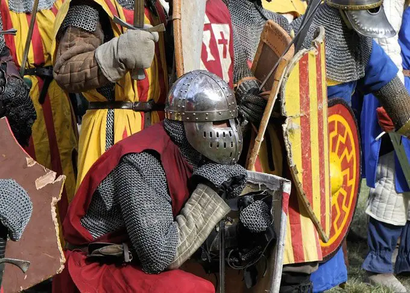

# Team 06: Larpmaxxing

<link rel="stylesheet" href="style.css"> 

## Team Values
- Communication
- Respect
- Collaboration
## Team Members
### Sean Yang (Team Lead 1)
**Github:** [sundayred](https://github.com/sundayred)

- 3rd Year Computer Science Major
- I enjoy napping in my free time
---
### Zayn Ashraf (Team Lead 2)
**Github:** [zaynashraf](https://github.com/zaynashraf)

- 3rd year Computer Science major
- Curious and open minded
---
### Aidan Fuller
**Github:** [aidanfuller9](https://github.com/aidanfuller9)

- 3rd Year Computer Engineering Major
- I enjoy cycling in my free time
- 
---
### Nicholas Adams 
**Github:** [n3adams-stack](https://github.com/n3adams-stack)

- 3rd Year Computer Science Major
- I enjoy gymming, backpacking and gaming in my free time
---
### Arpita Pandey 
**Github:** [arpita-pandey](https://github.com/arpita-pandey)

- 
- 
---
### Maxime Vergnet 
**Github:** [MaximeVergnet](https://github.com/MaximeVergnet)

- 2nd year Computer Science major 
- I enjoy surfing on my free time
---
### Dishita Joshi 
**Github:** [DishitaJoshi23](https://github.com/DishitaJoshi23)

- 2nd year Computer Science major
- I enjoy playing guitar on my free time
---
### Ethan Tran 
**Github:** [chickenlittle5](https://github.com/chickenlittle5)

- 3rd year Computer Science major
- I enjoy playing pickel ball on my free time
---
### Kevin Chung 
**Github:** [kpchung0407](https://github.com/kpchung0407)

- 3rd year Computer Science major 
- I enjoy playing chess on my free time
---
### Stephanie Chung
**Github:** [schung06](https://github.com/schung06)

- 2nd year CS major
- I enjoy reading in my free time
